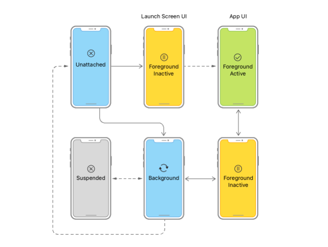
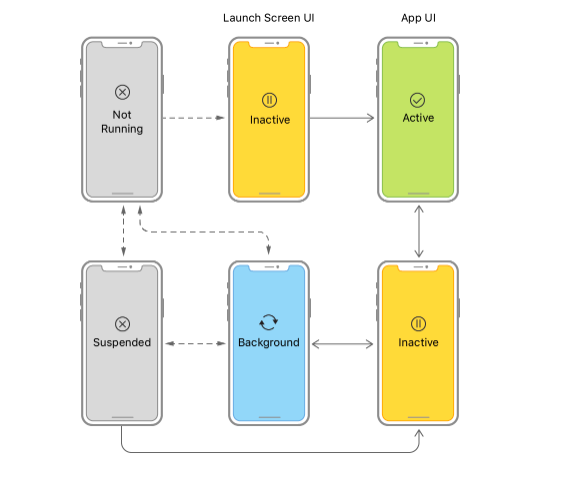
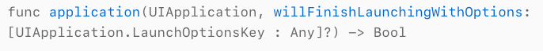
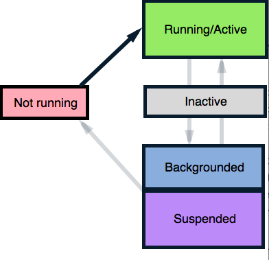
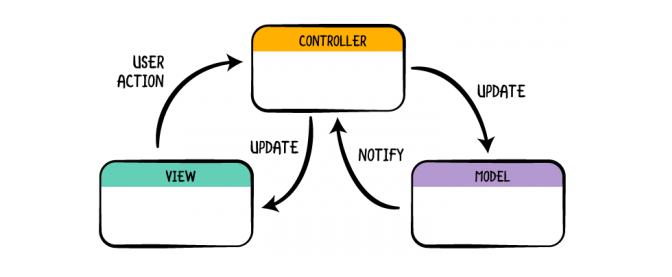
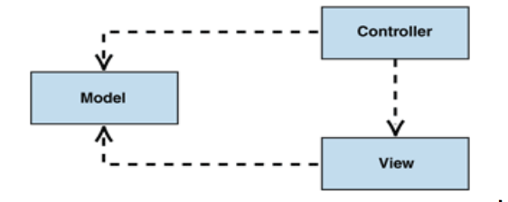
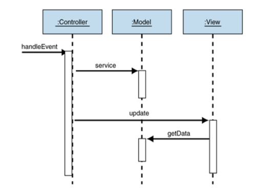
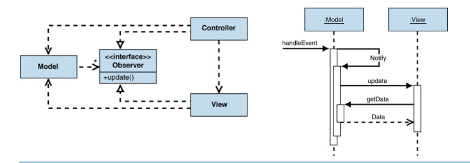
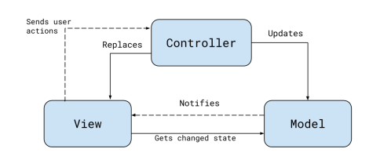

### Preguntas de Prework 

#### Teoría: 

1. Investiga el ciclo de vida de una app y haz el diagrama correspondiente donde se vean todos los estados. 

El estado actual de una aplicación determina lo que puede y no puede hacer en cualquier momento. Por ejemplo, una aplicación en primer plano tiene la atención del usuario, por lo que tiene prioridad sobre los recursos del istema. Por el contrario, una aplicación en segundo plano debe hacer el menor trabajo posible (preferiblemente nada), porque está fuera de pantalla. A medida que la aplicación cambia de estado a estado, se debe ajustar su comportamiento en consecuencia.

Cuando el estado cambia, UIKit lo notifica: 

- En iOS 13 y versiones posteriores, se usan objetos para responder a eventos de ciclo de vida de una apliacación basada en escenas. [**UISceneDelegate**](https://developer.apple.com/documentation/uikit/uiscenedelegate)

- En iOS 12 y versiones anteriores, se usa el objeto para responder a eventos del ciclo de vida [**UIApplicationDelegate**](https://developer.apple.com/documentation/uikit/uiapplicationdelegate)

### Eventos del ciclos de vida basados en escena

Una escena representa una instancia de la interfaz de usuario de  su aplicación que  se ejecuta en un dispositivo. El usuario puede crear múltiples escenas para cada aplicación, mostrarlas y ocultarlas por separado. Como cada escena tiene su propio ciclo de vida, cada una puede estar en un estado diferente de ejecución. UIKit ofrece eventos de ciclo de vida separados para cada uno. 

Cuando el usuario o el sistema solicita una nueva escena para su aplicación UIKit la crea y coloca en el estado no conectado. Las escenas solicitadas por el usuario se mueven rápidamente al primer plano, donde aparecen en la pantalla. Una escena solicitada por el sistema generalmente se mueve al fondo para que pueda procesar un evento, por ejemplo, el sistema puede iniciar la escena en segundo plano para procesar une vento de ubicación.

**La siguiente imagen muestra las transiciones de estados para escenas.**

Utilice las transiciones de escena para realizar las siguientes tareas:

- Cuando **UIKit** conecta una escena a su aplicación, se debe configurar la IU inicial de la escena y cargar los datos que se necesita.

- Al realizar la transición al estado activo en primer plano, se debe configurar su IU y preparar para interactuar con el usuario. Consulte [Preparación de su IU para ejecutarse en primer plano](https://developer.apple.com/documentation/uikit/app_and_environment/scenes/preparing_your_ui_to_run_in_the_foreground) .

- Al salir del estado activo en primer plano, deben guardarse datos y silenciar el comportamiento de la aplicación. Consulte [Preparación de su IU para ejecutar en segundo plano](https://developer.apple.com/documentation/uikit/app_and_environment/scenes/preparing_your_ui_to_run_in_the_background) .

- Al ingresar al estado de fondo, se debe finalizar tareas cruciales, liberar la mayor cantidad de memoria posible y prepararse para la instantánea de su aplicación. Consulte [Preparación de su IU para ejecutar en segundo plano](https://developer.apple.com/documentation/uikit/app_and_environment/scenes/preparing_your_ui_to_run_in_the_background) .

- En la desconexión de la escena, se deben limpiar los recursos compartidos asociados con la escena.

- Además de los eventos relacionados con la escena, también debe responder al inicio de la aplicación utilizando [UIApplicationDelegate](https://developer.apple.com/documentation/uikit/uiapplicationdelegate). Para obtener información sobre qué hacer al iniciar la aplicación, consulte [Responding to the Launch of Your App](https://developer.apple.com/documentation/uikit/app_and_environment/responding_to_the_launch_of_your_app)

### Eventos de ciclo de vida basados en aplicaciones.

Aquí el delegado de la aplicación administra todas las ventanas de su aplicación, incluidas las que se muestran en pantallas separadas. Es decir, las transiciones de estado de la aplicación afectan la interaz de usuario completa de la aplicación, incluido el contenido de pantallas externas. [UIApplicationDelegate](https://developer.apple.com/documentation/uikit/uiapplicationdelegate)

 Despúes del inicio, el sistema coloca la apliacación en el estado inactivo o en segundo plano, dependiendo de si la UI está a punto de aparecer en la pantalla. Cuando se inicia en primer plano, el sistema pasa la apliacación al estado activo automaticámente. Después de eso, el estado titubea entre activo y en segundo plano hasta que la aplicación finaliza.

**La siguiente imagen muestra las transiciones de estado que involucran el objeto delegado de la aplicación**

Use las transiciones de la aplicación para realizar las siguientes tareas:

- En el lanzamiento, inicializar las estructuras de datos y la interfaz de usuario de la aplicación. Consulte [Responder al lanzamiento de su aplicación](https://developer.apple.com/documentation/uikit/app_and_environment/responding_to_the_launch_of_your_app) .

- En la activación, se termina de configurar su IU y se prepara para interactuar con el usuario. Consulte [Preparación de su IU para ejecutarse en primer plano](https://developer.apple.com/documentation/uikit/app_and_environment/scenes/preparing_your_ui_to_run_in_the_foreground) .

- Tras la desactivación, se deben guardar los datos y silenciar el comportamiento de la aplicación. Consulte [Preparación de su IU para ejecutar en segundo plano](https://developer.apple.com/documentation/uikit/app_and_environment/scenes/preparing_your_ui_to_run_in_the_background) .

- Al ingresar al estado de fondo, se debe finalizar las tareas cruciales, liberar la mayor cantidad de memoria posible y prepararse para la instantánea de su aplicación. Consulte [Preparación de su IU para ejecutar en segundo plano](https://developer.apple.com/documentation/uikit/app_and_environment/scenes/preparing_your_ui_to_run_in_the_background) .

- Al finalizar, se tiene que detener todo el trabajo de inmediato y liberar los recursos compartidos. Ver .[applicationWillTerminate(_:)](https://developer.apple.com/documentation/uikit/uiapplicationdelegate/1623111-applicationwillterminate) .

**UIApplicationDelegate:** proporciona métodos reemplazables para todo el ciclo de vida de la aplicación.

**willFinishLaunchingWithOptions:** Le dice al delegado que el proceso de lanzamiento ha comenzado pero que la restauración del estado aún no ha ocurrido

**didFinishLaunchingWithOptions:** Le dice al delegado que el proceso de lanzamiento está casi listo y que la aplicación está casi lista para ejecutarse.

**applicationWillEnterForeground:** Le dice al delegado que la aplicacion está a punto de entrar en primer plano.

**applicationDidBecomeActive:** Le dice al delegado que la aplicación se ha activado.

**applicationWillResignActive:** Le dice al delegado que la aplicación está a punto de quedar inactiva.

**applicationDidEnterBackground:** Le dice al delegado que la aplicación estará en segundo plano.

**applicationWillTerminate:** Le dice al delegado cuándo la aplicación está a punto de finalizar.

### Estados de la app

- **Not running:** la aplicación aún no se ha iniciado en el dispositivo.

- **Running/Active:** la aplicación está en la pantalla y está ejecutando código en primer plano.

- **Inactive:** la aplicación se ve interrumpida por una llamada telefónica entrante, un mensaje de texto u otra interrupción.

- **Backgrounded:** la aplicación pasa a segundo plano y continúa ejecutando código de fondo.

- **Suspended:** si la aplicación no tiene ningún código para ejecutar en segundo plano, o si todo el código se ha completado, el sistema operativo suspenderá la aplicación. El proceso de una aplicación suspendida se mantiene activo, pero la aplicación no puede ejecutar ningún código en este estado.

- **Return to not Running/Termination (Rare):** ocasionalmente, el proceso de la aplicación se destruye y la aplicación vuelve al estado Not running. Esto sucede en situaciones de poca memoria o si el usuario finaliza manualmente la aplicación.

2. Investigar la arquitectura MVC.

## Arquitectura Modelo Vista Controlador

MVC son las siglas de Model-View-Controller.

Su filosofía es muy simple: Debes dividir tu sofware en 3 capas distintas y separadas, donde cada capa tiene una única responsabilidad.

Las tres capas son: 

 - **Model:** Aqui es donde almacenamos los datos de nuestra aplicación. Las clases que gestionen la persistencia de datos, los objetos modelos, los parsers ... deberían ser clases de tipo Modelo.

 - **View:** Es la cara de nuestra app. Es la encargada de definir la interfaz de nuestra aplicación. Sus clases deben ser reusables, es decir, no deberían depender de ningún tipo de lógica. Un ejemplo claro de una clase de tipo View seria **UILabel.**

 - **Controller:** Es la intermediaria entre Model y View. Su principal misión es mantener sincronizadas ambas capas. Un ejemplo de una clase de tipo Controller sría **UIViewController.**

 **Nota:** Las capas Model y View **no se comunican directamente**, sino que utilizan la capa Controller como intermediario.

 

**Dependencias**

- Tanto la vista como el controlador dependen del modelo. Sin
embargo, el modelo no depende ni de la vista ni del
controlador.
- La separación permite que el modelo sea construido y
probado independientemente de la presentación visual.
- La separación entre vista y controlador es secundaria en
muchas aplicaciones, sin embargo en las aplicaciones Web
la vista (el navegador) y el controlador (los componentes del
lado servidor) están bien definidos.

**Comportamiento MVC (pasivo)**

- Es utilizado cuando un controlador manipula el modelo exclusivamente.

- El controlador modifica el modelo y le informa a la vista que este ha cambiado y debe
ser refrescada.

- En este escenario el modelo es completamente independiente de la vista y del
controlador.

**Comportamiento MVC (activo)**

- Es usado cuando el modelo cambia de estado sin la intervención del controlador, lo cual puede pasar cuando otras fuentes están cambiando los datos y los datos deben reflejarse en la vista.

- Debido a que solo el modelo detecta los cambios a su estado interno cuando estos ocurren, el modelo deberá notificar a la vista para refrescarla, pero esto crearía una dependencia entre el modelo y la vista, lo cual iría en contra de uno de los principios del patrón MVC.

- Como solución, se introduce el patrón Observer, el cual provee un mecanismo para alertar a otros objetos de cambios de estado sin introducir dependencias entre ellos.

**Patrón original de MVC**

En el modelo de arquitectura MVC original, la vista carece de estado y es actualizada por el controlador cada vez que se recibe un cambio, por lo que los componentes del modelo de arquitectura están estrechamente unidos, ya que cada uno de ellos está relacionado con los demás, por lo que la reutilización de cada uno se ve drásticamente reducida, debido a su dependencia.

**MVC propuesto por Apple**

Apple propone un modelo de arquitectura en el cual el Controlador es un mediador
entre la Vista y el Modelo, deshaciendo la relación de dependencia que existía entre estos en el patrón MVC original.

3. Investiga las diferencias entre una clase y una estructura en Swift.

- Las estructuras generan automáticamente inicializadores, mientras que las clases no lo hacen.

- Las estructuras son **value types** y las clases **reference types.**

**Value Type:** cuando se crea una instancia de una estructura y se asigna a otra instancia o se pasa como parámetro a una función, realmente se crea una copia, tal que, cualquier modificación no afecta a la instancia original. Es decir, tanto el original como la copia son cosas diferentes, cambiar uno no cambiará el otro.

**Reference Type:** cuando creamos un objeto de una clase y se la asignamos a otra instancia o la pasamos como parámetro de una función, se pasa una referencia a la memoria de la instancia original, por lo que cualquier cambio en cualquier pare de nuestro programa afectará la instancia original.

- Las estructuras **no manejan herencia,** es decir no se puede heredar comportamiento de otras estructuras (para solucionar esto se utilizan **protocolos**), mientras que las clases **sí soportan herencia simple.**

**Protocolo:** un protocolo nos permite indicar las cabeceras de funciones o propiedades que queramos se incluyan de manera obligada para cumplir con una especificación que, posteriormente, tendrá una implementación asociada (un código que le de funcionalidad).

- Inmutabilidad, en las estructuras **todo es inmutable por defecto.** Para poder modificar una estructura, hay que poner la palabra **mutating** delante de la firma de la función. En el caso de las clases, aunque declares un objeto como constante (con let), puedes modificar sus propiedades si estas están declaradas como var.

**Nota** La palabra mutating, en realidad, reemplaza el value type anterior por el nuevo. Es decir, en realidad no se modifica, sino que se crea uno nuevo con los datos modificados que sustituye al anterior.

- Las estructuras de crean en el Stack y las clases lo hacen en el Heap.
**Stack:** funciona bajo el concepto de LIFO (last in first out), de ahí su rapidez y eficiencia.

El Heap (o almacenamiento libre) es una enorme pieza de memoria que el sistema puede soliciar reservar un trocito para su uso (mediante alloc). Añadir o borrar memoria del heap es un proceso más costoso y pesado.

- Los desinicializadores son funciones que se ejecutan justo antes de que la instancia de una clase sea destruida o liberada, aunque ARC nos ayuda con las tareas de memoria, en las clases siempre es importante liberar cualquier recurso que estemos manejando. Las estructuras no soportan esto y no tiene sentido puesto que son “Value Type”.

4. Investiga a qué se refiere que Swift sea un lenguaje orientado a protocolos.

#### Swift: 

** Los ejercicions háganlos en un Swift Playground o en http://online.swiftplayground.run/ si no tienes Mac y guarda el archivo con extensión **.swift**

*** Entra a https://www.hackingwithswift.com/sixty y haz los ejercicios siguientes:

1. Classes 
2. Classes
3. Protocols and extensions 
4. Optionals